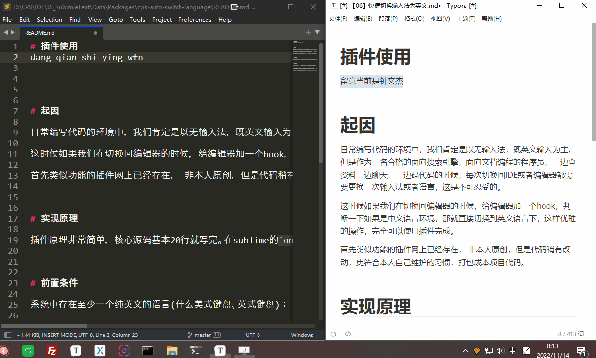
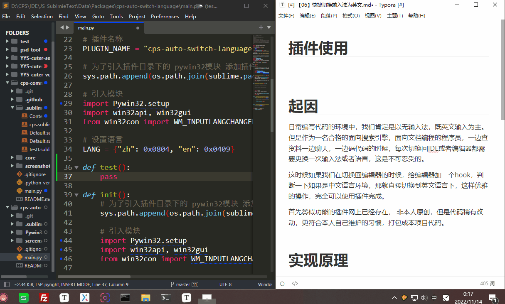
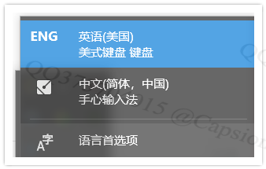
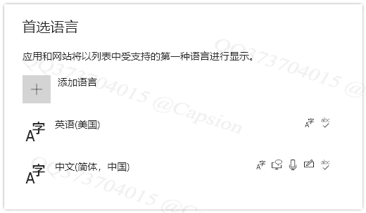

# 简介|Introductions

日常编写代码的环境中，一码代码一边查资料，一边聊天一边码代码：`英文输入`>`中文输入`>`英文输入`>`...`这样的场景来来回回，每次切换场景总会要手动切换一下输入法，非常不优雅。

首先类似功能的插件网上已经存在， 非本人原创，但是代码稍有改动，更符合本人自己维护的习惯，打包成本项目代码。

# 使用|Usage

每次激活Sublime Text时，系统自动切换为英文输入环境（不是输入法）。

    
    
    

## 使用演示1

## 使用演示2

# 实现原理

- 在sublime的`on_activated_async`钩子（编辑器被激活时的钩子）时，触发一个切换语言的系统调用，将当前系统语言切换成英语。

# 前置条件

系统中存在至少一个纯英文的语言(美式键盘)：

具体设置：
- 系统设置>语言页面中可以看到除了`中文（简体，中国）`，还带了一个`英语（美国）`，这个`英语（美国）`就是一个纯英文的系统语言。

