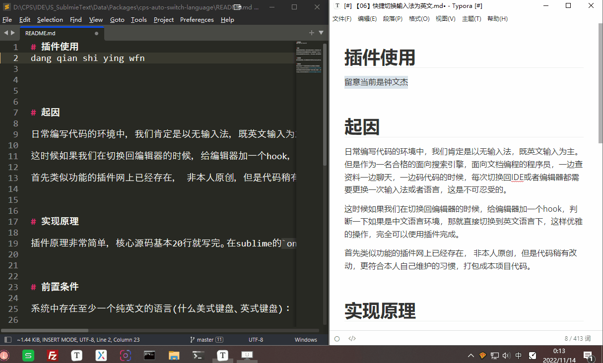
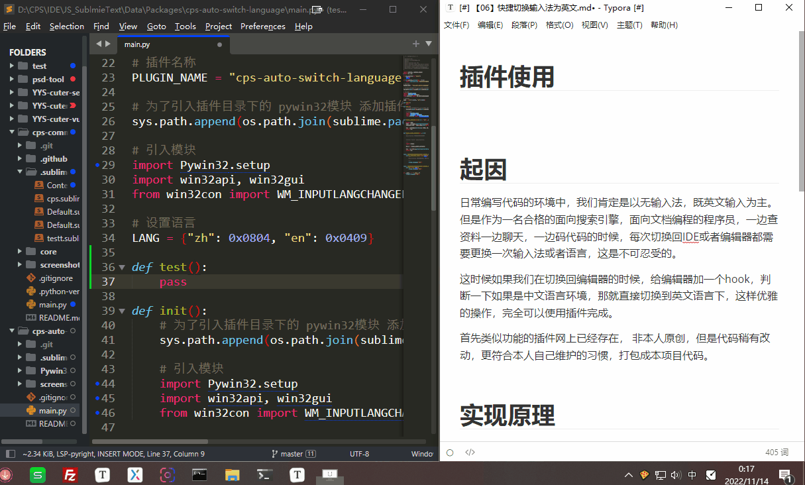
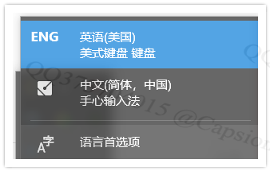
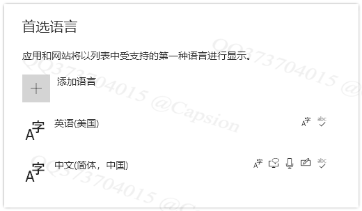

# 简介|Introductions

日常编写代码的环境中，我们肯定是以无输入法，既英文输入为主。但是作为一名合格的面向搜索引擎，面向文档编程的程序员，一边查资料一边聊天，一边码代码的时候，每次切换回IDE或者编辑器都需要更换一次输入法或者语言，这是不可忍受的。

这时候如果我们在切换回编辑器的时候，给编辑器加一个hook，判断一下如果是中文语言环境，那就直接切换到英文语言下，这样优雅的操作，完全可以使用插件完成。

首先类似功能的插件网上已经存在， 非本人原创，但是代码稍有改动，更符合本人自己维护的习惯，打包成本项目代码。

# 使用|Usage

每次进入Sublime Text编辑视图范围时，自动切换为英文输入。

    
    
    

## 使用演示

# 实现原理

插件原理非常简单，核心源码基本20行就写完。在sublime的`on_activated_async`钩子（编辑器被激活时的钩子）时，触发一个切换语言的系统调用，将当前系统语言切换成英语。

# 前置条件

系统中存在至少一个纯英文的语言(什么美式键盘、英式键盘)：

在系统设置>语言页面中可以看到除了`中文（简体，中国）`，还带了一个`英语（美国）`，这个`英语（美国）`就是一个纯英文的系统语言。

